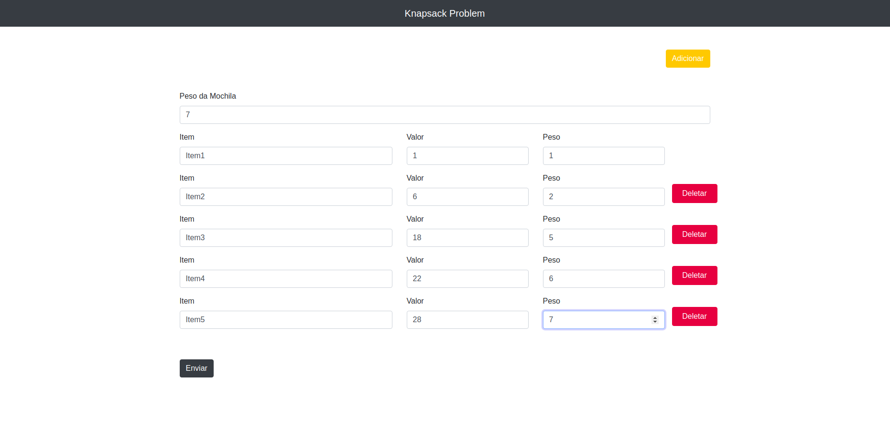
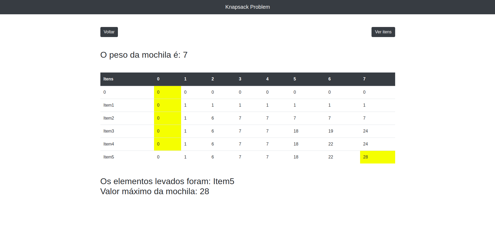
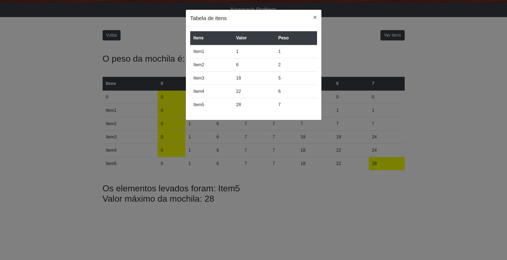

# Lista 5 - Knapsack problem 

## Integrantes

|Matrícula|Nomes|
|---|---|
|16/0123186 | Guilherme Guy |
|16/0128013 | Joberth Rogers |

## Instruções

* Para verificar as funcionalidade do projeto acesse o link: https://projeto-de-algoritmos.github.io/List5-Joberth-Guilherme/ .
* Entre com a quantidade do peso total da mochila e os itens da a ser análisado. **Obs:** Caso queira adicionar mais itens, clique em **adicionar** e mais campos de item serão adicionados para ser preenchidos.
* Aperte no botão **Enviar**.
* Em seguida será mostrado a matriz de solução, o valor máximo que a mochila suporta e os itens carregados no problema.
* Caso queira ver os itens adicionados anteriormente, basta clicar em: **Ver itens** e um modal mostrará os itens análisados.

## Screenshots

